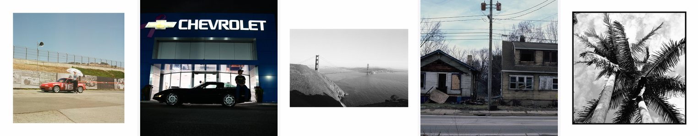
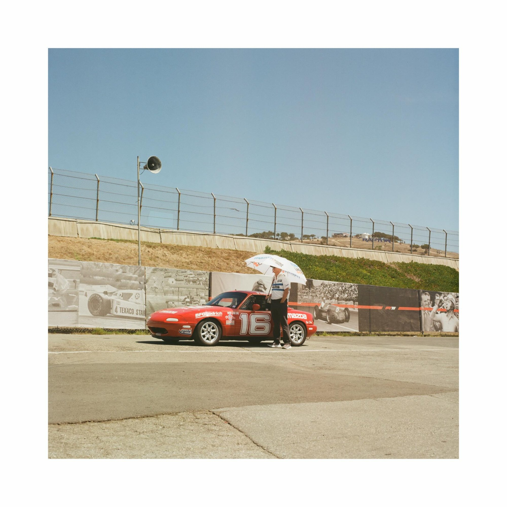
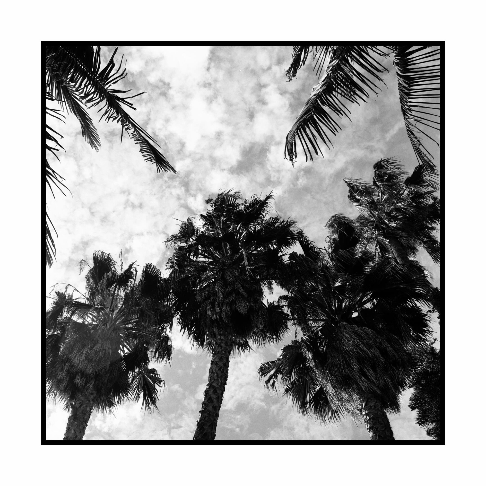
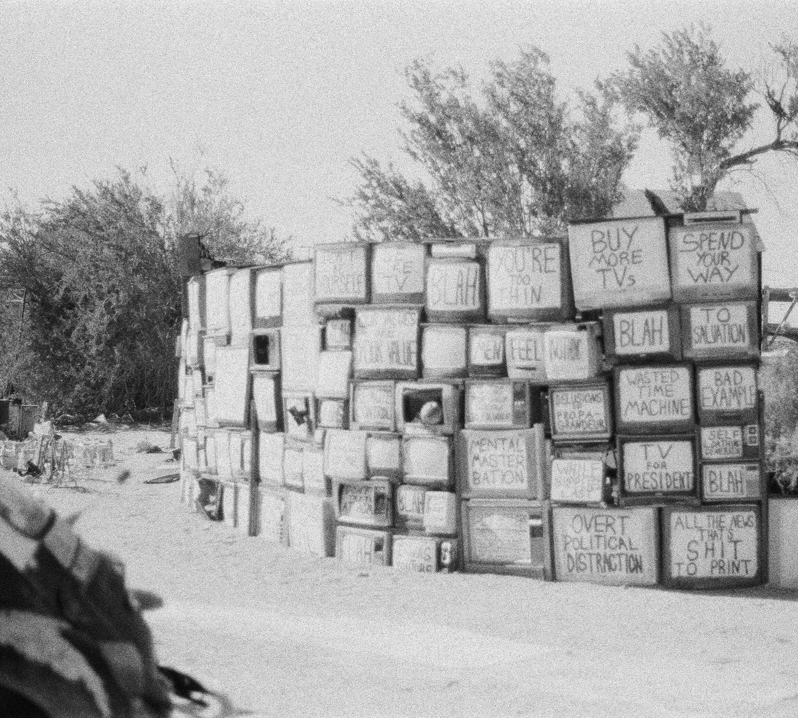

<a href="https://jxgreer1.github.io/jxgreer1/">
  
</a>

<h1 align="center">Jack Greer</h1>

<p align="center">
  Industrial Engineering student&nbsp; ·&nbsp; Co-op at Tesla&nbsp; ·&nbsp; Film Photography nerd
</p>

<p align="center">
  <a href="https://jxgreer1.github.io/jxgreer1/"></a>
  <a href="https://www.instagram.com/jgreerfilm/"></a>
  <a href="https://www.linkedin.com/in/jack-greer-14b435104/"></a>
  <a href="https://github.com/jxgreer1"></a>
  <a href="mailto:gree7626@kettering.edu"></a>
</p>

<p align="center"><strong><a href="https://jxgreer1.github.io/jxgreer1/">See the full site →</a></strong></p>

---

I study industrial engineering at Kettering, which runs on alternating terms, so I spend
three months in class and three months working, back and forth.

Currently I co-op at Tesla in the Bay Area. I'm a PCBA SIE working on creating apps to help
manage our team's internal structure, as well as measuring capacity across all our suppliers.
I go on site as well and solve problems daily to help keep lines running.

<br>

<details>
<summary><b>Experience</b> &nbsp;<sub>click to expand</sub></summary>
<br>

**Tesla** &nbsp;·&nbsp; Supplier Industrialization Engineer, PCBA &nbsp;·&nbsp; Palo Alto, CA &nbsp;·&nbsp; Jan 2026 to now

Defined and validated end-to-end production with contract manufacturers. Brought average PCB
cost down **38%** and cycle time down **73%** across suppliers. Built a capacity planning tool
that maps supplier EDI demand to line level PCBAs so utilization risk shows up before it bites.

**Brembo North America** &nbsp;·&nbsp; Industrial Engineering Intern &nbsp;·&nbsp; Jackson, MI &nbsp;·&nbsp; Jan to Mar 2025

Moved outsourced production back in house and saved **$200K a year** doing it. Reworked the
end-of-arm tooling so maintenance went from weekly to quarterly. 3D-scanned 75+ pattern plates
and built color maps to track wear.

**Advanced 3D Printing** &nbsp;·&nbsp; PCB Designer &nbsp;·&nbsp; Los Angeles, CA &nbsp;·&nbsp; Jan 2023 to Dec 2024

Designed small plug-and-play boards that became standard in high-speed custom printer builds.
Sold over **500** of them and ran tier-3 support.

**FRC 1836** &nbsp;·&nbsp; Captain &nbsp;·&nbsp; Los Angeles, CA &nbsp;·&nbsp; Jun 2023 to Jun 2024

Ran the school robotics team. Design instruction, tournament logistics, and keeping everyone
pointed the same direction.

</details>

<details>
<summary><b>Education</b> &nbsp;<sub>click to expand</sub></summary>
<br>

**Kettering University** &nbsp;·&nbsp; BS, Industrial Engineering &nbsp;·&nbsp; Flint, MI &nbsp;·&nbsp; Oct 2024 to now

Junior, B-Section. Kettering alternates academic and work terms, so the degree runs
alongside the co-op rather than after it.

**Milken Community School** &nbsp;·&nbsp; Los Angeles, CA &nbsp;·&nbsp; Aug 2020 to Jun 2024

</details>

<details>
<summary><b>Tools</b> &nbsp;<sub>click to expand</sub></summary>
<br>

| | |
|---|---|
| **Design** | Altium, KiCad, Fusion 360, SolidWorks, Onshape |
| **Validation** | Metrology, 3D scanning, PolyWorks, data analysis |
| **Method** | Lean, 8D, A3, DFM for PCBA, PCB, and Flex |
| **Stack** | Jira, Enovia, Git, Excel, LLM tooling |

</details>

<details>
<summary><b>Photographs</b> &nbsp;<sub>click to expand</sub></summary>
<br>

Shot on film, scanned, posted to [@jgreerfilm](https://www.instagram.com/jgreerfilm/).
These update themselves, see <i>How this repo works</i> below.

<table>
<tr>
<td width="33%"><a href="https://www.instagram.com/p/DceQvfAmdCo/"></a><sub>Laguna Seca, Car Week 26</sub></td>
<td width="33%"><a href="https://www.instagram.com/p/DbR-vGJlBqL/"></a><sub>H A S S E L B L A D</sub></td>
<td width="33%"><a href="https://www.instagram.com/p/Da0v8lGGfxb/"></a><sub>W O R K S A T U R D A Y</sub></td>
</tr>
<tr>
<td><a href="https://www.instagram.com/p/DZ7a0n2lTbc/"></a><sub>Jun 23, 2026</sub></td>
<td><a href="https://www.instagram.com/p/DWA5L4llYVE/"></a><sub>Marin. 03/26</sub></td>
<td><a href="https://www.instagram.com/p/DTgZ73eEmLV/"></a><sub>Flint</sub></td>
</tr>
</table>

<p><a href="https://jxgreer1.github.io/jxgreer1/#photographs"><b>All of them, full size →</b></a></p>

</details>

<details>
<summary><b>How this repo works</b> &nbsp;<sub>click to expand</sub></summary>
<br>

This repo is two things at once: my GitHub profile, and the site itself.

```
index.html                         the whole site, no build step
ig/                                the photographs
tools/sync_instagram.py            pulls the latest posts
.github/workflows/sync-instagram.yml   runs it daily
DOMAIN.md                          how to point a domain here
```

**Hosting.** Settings &rsaquo; Pages &rsaquo; Deploy from a branch &rsaquo; `main` / root.

**Getting every photo into the picker.** Instagram only shows a logged out
visitor the newest dozen posts, so the back catalogue has to come from the export:
Instagram &rsaquo; Settings &rsaquo; Accounts Centre &rsaquo; Your information and
permissions &rsaquo; Download your information &rsaquo; **JSON**, all time. Then:

```sh
python3 tools/import_export.py ~/Downloads/instagram-jgreerfilm.zip
python3 tools/build_gallery.py        # after picking, applies photos.config.json
```

The importer splits carousels, so every slide is selectable on its own, and keeps
full size copies in `ig/originals/`. These are the files as you uploaded them, which
beats anything the public CDN serves.

**Choosing which photos show.** Open **`picker.html`** (double click it, or visit
[the hosted copy](https://jxgreer1.github.io/jxgreer1/picker.html)). Every post is
laid out as a grid: click to show or hide, switch to Manual order to arrange them,
then copy the JSON it builds into `photos.config.json` and commit.

Auto keeps new posts flowing in and skips whatever you switched off. Manual order
pins exactly the photos you picked, in your order, so nothing new appears until you
go back to the picker.

Editing `photos.config.json` by hand works too:

```jsonc
{
  "mode": "auto",   // newest first, minus "hide", capped at "limit"
  "limit": 12,
  "hide":  ["DTgZ4mzkqg6"],            // drop individual posts
  "order": []                          // mode "manual": exactly these, in this order
}
```

A post code is the part after `/p/` in its URL. Each sync also regenerates `FEED.md`,
a table of every post with its code, and `photos.manifest.js` plus `ig/thumbs/`, which
are what the picker reads.

**Keeping the photos current.** A scheduled Action reads the Behold feed nightly,
archives anything new at full resolution, merges it into `photos.manifest.js`, then
applies `photos.config.json`. Set it up by adding the feed URL as a repository
variable named `BEHOLD_FEED_URL` (Settings &rsaquo; Secrets and variables &rsaquo;
Actions &rsaquo; Variables). Without it the workflow exits cleanly and nothing moves.
Run it by hand any time from the Actions tab.

The archive only ever grows. A free Behold feed returns a short recent window, so
posts that scroll out of it stay in the manifest and remain pickable. Carousels are
split into their slides; `onePerPost` keeps a six slide carousel from swallowing the
page, and switching it off lets individual slides through.

</details>

<br>

<p align="center">
  <a href="https://jxgreer1.github.io/jxgreer1/"></a>
</p>
